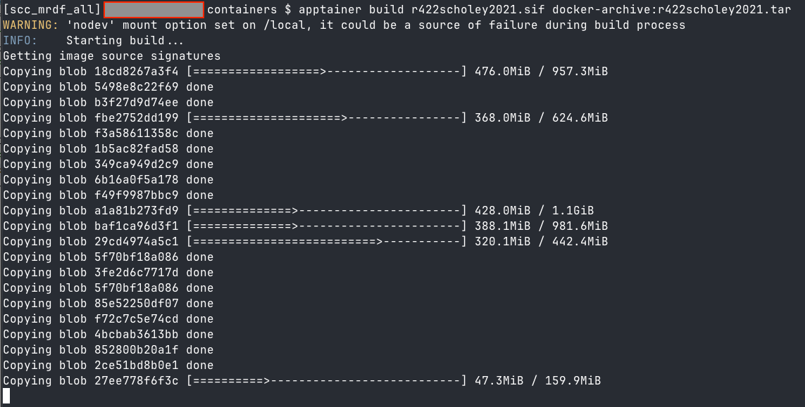

This repository contains the code from **Schöley, J., 2021. The centered ternary balance scheme: A technique to visualize surfaces of unbalanced three-part compositions. Demographic Research 44, 443–458. [https://doi.org/10.4054/DemRes.2021.44.19](https://doi.org/10.4054/DemRes.2021.44.19)** . Compared to the code that is published along with the original article, the code in this repository is containerized to make it work as of 2025-03-13, as the code relies on deprecated R packages that cannot be easily installed anymore.

In case the GitHub container registry starts charging for storate of containers or becomes unavailable in the future, the preserved container images for both Docker and Apptainer are available at: [](https://doi.org/10.5281/zenodo.15024144).

<br><br><br><br>

## Run this repository in a web browser using Binder. Push the button \>\> [](https://mybinder.org/v2/gh/e-kotov/demographic-research.44-19-containerized/HEAD?urlpath=rstudio)

<br><br><br><br>

# Brief log of how this repo and the underlying container image were created

Below is a very brief log of actions performed to inspect the code, identify and lock the required R packages, build the container and push it to the GitHub container registry so that it is available to the [mybinder.org](https://mybinder.org) service for running in the cloud with just a web browser. **This log is not intended for novice users and is more of a scratchpad used by the author.**

```bash
docker run --platform linux/amd64 -it --rm -v "$(pwd):/home/rstudio" -p 8787:8787 rocker/geospatial:4.2.2
```

```r
install.packages("renv", repos = "https://p3m.dev/cran/__linux__/jammy/latest")
```

```r
renv::init(force=TRUE)
```

Restart R

```r
renv::settings$ppm.enabled(value = TRUE)
renv::settings$snapshot.type(value = "all")
options("renv.config.pak.enabled" = TRUE)
```

Also add `options("renv.config.pak.enabled" = TRUE)` to `.Rprofile`.

```r
install.packages("pak", repos = "https://p3m.dev/cran/__linux__/jammy/latest")
```

```r
renv::status()
```

Many packages will still be missing, install them manually as you go through the R scripts.
Easiest way to install them is to open the source files and let RStudio show the button with missing dependencies and click install. The background job will use renv and pak.
Some packages will be missing even after that, so install them manually.

```r
renv::snapshot()
```

```r
install.packages(c("cpp11", "progress", "RcppArmadillo"))
```


```r
renv::snapshot()
```

```r
renv::status()
```

Stop the docker container.

Create the Dockerfile in Dockerfile4build.

```bash
docker build --platform linux/amd64 -f Dockerfile4build/Dockerfile -t r422scholey2021 .
```

```bash
docker tag r422scholey2021 ghcr.io/e-kotov/demographic-research.44-19-containerized:latest
```

```bash
docker push ghcr.io/e-kotov/demographic-research.44-19-containerized:latest
```

Create a `Dockerfile` file for Binder in the root of the project.

Dump the container image to a tar file:

```bash
docker save -o ~/Downloads/r422scholey2021.tar r422scholey2021
```


In GWDG HPC (or other HPC, or other Linux system that you have access to), build an Apptainer container image from the Docker container image. Steps may vary, we use GWDG HPC as an example.

Start an interactive job on the HPC:

```bash
srun --partition jupyter --pty bash
```

Switch to the directory with the Docker tar file container image:

```bash
cd ~/scratch/containers/
```

Enable the Apptainer:

```bash
module load apptainer
```

Assuming the Docker image is saved as `r422scholey2021.tar` and uploaded to `~/scratch/containers/` and you are already in this folder on the HPC:

```bash
apptainer build r422scholey2021.sif docker-archive:r422scholey2021.tar
```

Alternatively, if the container is still available from the GitHub Container Registry, the Apptainer image can also be built directly from there:

```bash
apptainer build r422scholey2021.sif docker://ghcr.io/e-kotov/demographic-research.44-19-containerized:latest
```




Wait for:

```
INFO:    Creating SIF file...
INFO:    Build complete: r422scholey2021.sif
```

When done, check that the container image is there:

```bash
find r422scholey2021.sif
```

Now it can be downloaded from the HPC, and re-uploaded for preservation to Zenodo along with the Docker tar image.
